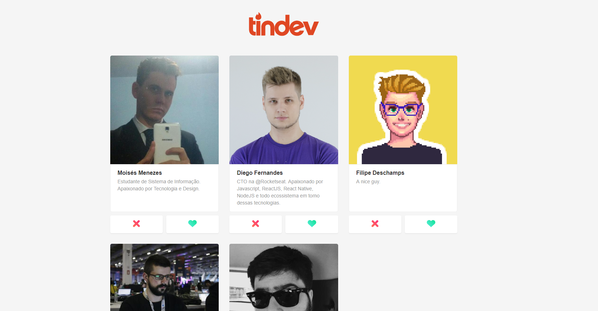

# Semana Omnistck 8.0

Projeto desenvolvido na semana Omnistack pela [RocktSeat](https://rocketseat.com.br/) onde desenvolvi uma aplicação chamada **Tindev**, onde usamos as tecnologias.
 - React JS (Front End)
 - Node JS(Back End)
 - React Native (Mobile) 
 
 Onde entramos na plataforma com o usuário do Github e buscamos na API seu nome, seu avatar e a bio do usuário, Aonde podemos dar match em um usuário. Onde este match pode ser visto simultaneamente na aplicação web e no Mobile. 
 
